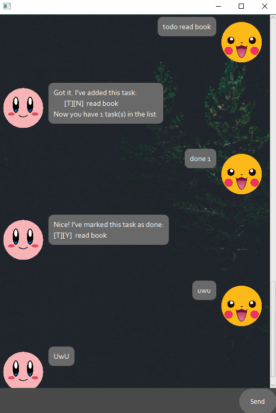

# User Guide

## Introduction
From saving Planet Pop Star to fighting other Nintendo Characters in an all-out brawl,
Kirby is now here to help you by being your very own chat bot task manager!

Kirby will help you keep track of your tasks. Give him secret commands for an easter egg response Uwu

### 1. Add `todo`
Add a `todo` task into the list of tasks with its description.

**Example of usage:**
> add read book

**Expected outcome:**
> Got it. I've added this task:
>    [T][N] read book
> Now you have 1 task(s) in the list.

### 2. Add `deadline`
Add a `deadline` task into the list of tasks with its description.

**Example of usage:**
> deadline return book /by 20/02/2020 2359

**Expected outcome:**
> Got it. I've added this task:
>    [T][N] return book (by: 20 Feb 2020 11:59PM)
> Now you have 1 task(s) in the list.

### 3. Add `event`
Add a `event` task into the list of tasks with its description.

**Example of usage:**
> event birthday party /at 28/02/2020 2100

**Expected outcome:**
> Got it. I've added this task:
>    [T][N] birthday party (at: 28 Feb 2020 9:00PM)
> Now you have 1 task(s) in the list.

### 4. Display `list`
Display `list` of all your tasks.

**Example of usage:**
> list 

**Expected Outcome:**
> Here are the tasks in your list:
> 1. [T][N] read book
> 2. [D][N] return book (by: 20 Feb 2020 11:59PM)
> 3. [E][N] birthday party (at: 28 Feb 2020 9:00PM)

### 5. Mark a task as `done`
Mark a `task` as `done`.

**Example of usage:**
> done 1

**Expected outcome:**
> Nice! I've marked this task as done:
> [T][Y] read book

## 6. `delete` a `task`
Deletes a task from the list of tasks.

**Example of usage:**
> delete 1

**Expected outcome:**
> Noted. I've removed this task:
>    [T][Y] read book
> Now you have 0 tasks(s) in the list.

### 6. `find` a `task`
Finds and lists all tasks with the input keyword.

**Example of usage**
> find book

**Expected outcome:**
> Here are the matching tasks in your list:
>    1.[T][N] read book

### 7. `clear` a `task`
Clears all the tasks in the list.

**Example of usage**
> clear

**Expected outcome**
> Kirby has cleared all the tasks in the list UwU

### 8. Assign `priority` to a `task`
Assigns a priority to a task and changes their order in the `list`.
3 Levels:
1. `high`
2. `medium`
3. `low`

Tasks with `priority` set to `high` appear at the top of the list, followed by `medium` and `low`.

**Example of usage**
> priority 2 high

**Expected outcome**
> Okay! I have change the priority of the following task: <task>
